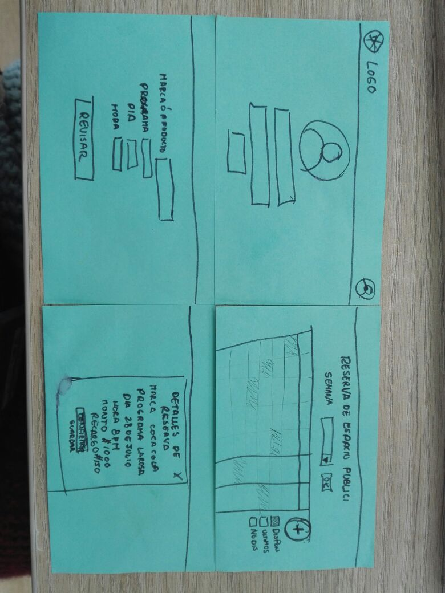
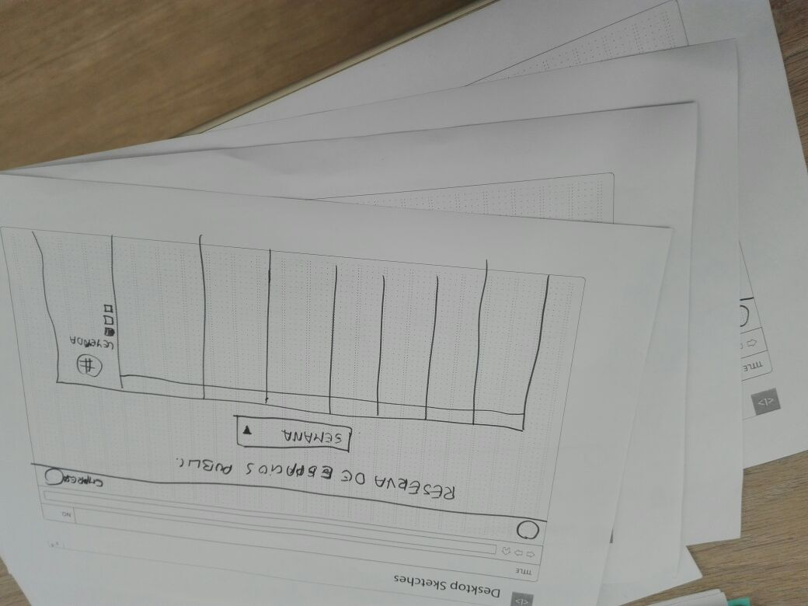
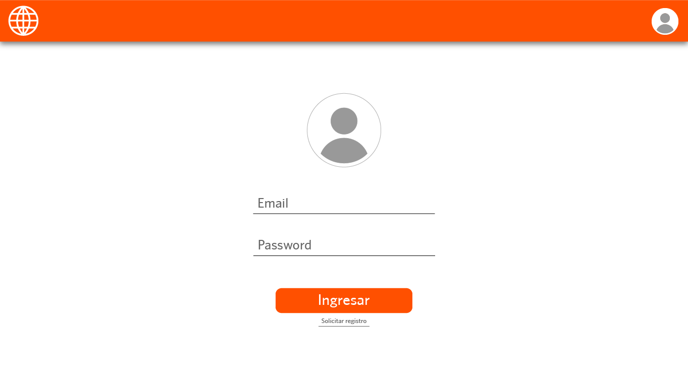
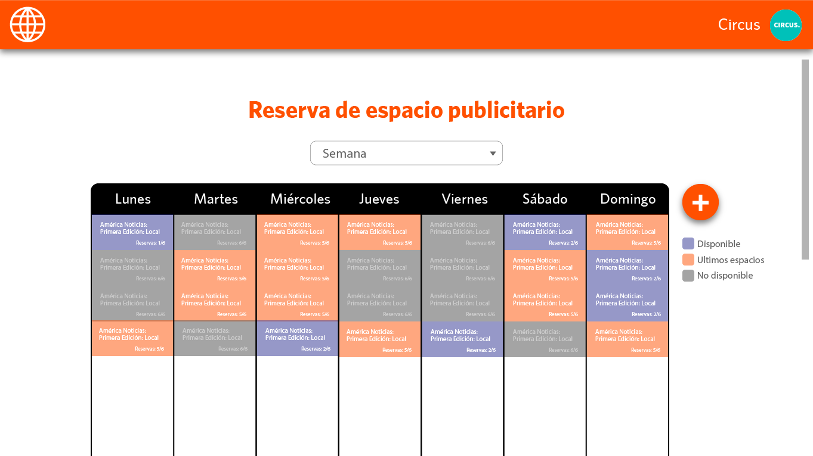
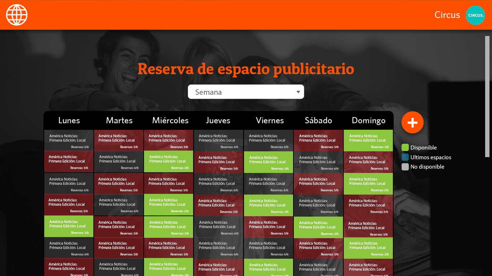
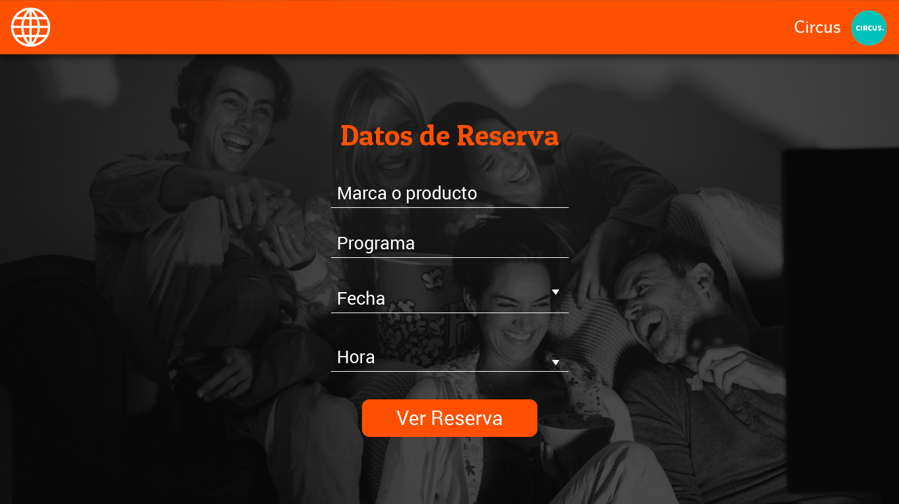
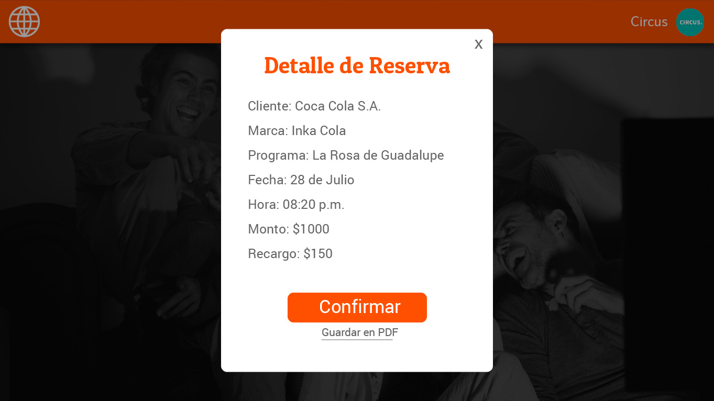

# RESERVA DE ESPACIOS PUBLICITARIOS

## EL RETO:
Miguel Ángel y Mafe representantes de Inovamerica, nos cuentan el enorme y molesto proceso por el cual se debe pasar antes de vender (en el caso de América) y comprar espacios publicitarios (en el caso de las agencias publicitarias); gracias a lo cual nace la idea de poder innovar en tecnología en un sector no tan convencional.

## HERRAMIENTAS**_

*[Trello]()

## NUESTRO PROCESO UX :

### Descubrimiento e investigación:

1. Después de presentado el reto se empezó a entrevistar a ambos encargados del proyecto, para conocer el propósito de este producto.
2. Teníamos cerca a Miguel ángel y Mafe que nos ayudaron a minimizar las dudas con respecto a lo que se quería lograr y que nos presentaron el problema y lo amplio que era.
3. Mafe había trabajado antes desde la parte contratante, por lo cual conocía los problemas por los cuales pasan sus actuales clientes. Esto nos ayudó a entender cuáles eran sus necesidades.

### Síntesis y definición:

1. ACUERDO:
Después de una deliberación con el equipo se pudo concluir cual podía ser nuestro MVP, ya que el problema que se intenta resolver debería tener muchos más procesos de los cuales podíamos incluir en estas 36 horas.

2. TEMAS ENCONTRADOS:
* La pérdida de tiempo que causa el proceso convencional de reserva de publicidad.
* América TV usa una tabla de excel para organizar sus publicidades y los colaboradores deben verificar en su sistema actual la disponibilidad del espacio, lo cual ocasiona sobretiempos.
* Este proceso se ha mantenido de esta forma por años, la cual hace que sea familiar para sus clientes, pero que a su vez es un proceso que no disfrutan.
* Las personas que desean poner en marcha este proyecto están conscientes de que es un proceso de prueba y error y que en el camino se van a encontrar muchas dificultades para ponerlo en marcha, pero cuando este proyecto este realizado será el inicio de procesos más limpios y rápidos en este sector.

3. PRESENTACIÓN DEL PROBLEMA:
La reserva de espacios publicitarios en tv que genera procesos que son largos y los cuales no ha mostrado variación alguna por años.

4. HMW (HOW MIGHT WE o Cómo podríamos):

      1.    _**HMW** mostrar la programación de América TV?_

      2.    _**HMW** hacer que los clientes puedan visualizar la información de sus espacios reservados?_

      3.    _**HMW** mostrar los precios que son variables antes de confirmar la reserva?_

      4.    _**HMW** mostrar a los usuarios cuales son los espacios disponibles?_

6. WHAT IF:

1.    What if solo quiere ver el horario de un solo programa?

2.    What if los espacios reservados siempre son los mismos?

3.    What if los precios siempre son estandart?

4.    What if siempre hay disponibilidad?

### Ideación:

1. FEATURE LIST:

* Una vista de ingreso a la plataforma, cuyo administrador y contraseña sean brindadas por América.

* Mostrar la programación de los programas y sus espacios publicitarios disponibles.

* Hacer una reserva cuando elija una fecha determinada.

* Mostrar un resumen de sus espacios separados.

2. PRIORIZACION:
* Vista de ingreso con correo y clave
* Mostrar la programación de América por semanas.
* Hacer la reserva mediante un formulario.

### PROTOTYPING & USER TESTING:
## Paper prototype

## Digital Prototype

## Segundo Digital Prototype
Mejoras de diseño

## Herramientas usadas
1. HTML 5
2. CSS 3
3. Javascript
4. Jquery
5. Materialize
6. Firebase
